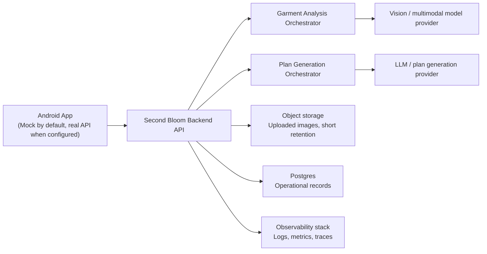
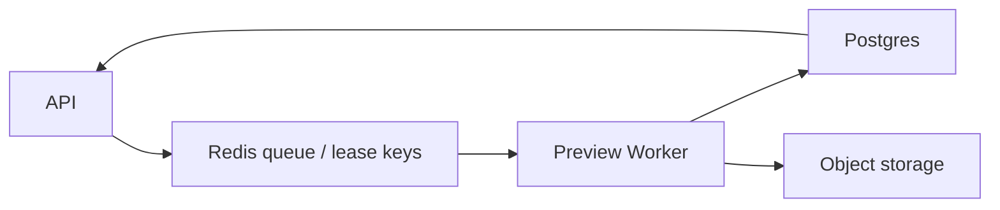

# Second Bloom MVP Backend Architecture

This document describes the proposed backend architecture for the first live Second Bloom service. It is intended to complement, not replace, the wire-level API contract in `docs/api/mvp-contract.md`.

Companion documents:

- `docs/api/mvp-contract.md` for public request and response payloads
- `docs/api/backend-delivery-plan.md` for implementation sequencing and concrete stack recommendations
- `docs/api/postgres-schema-draft.sql` for the first relational schema draft

Status on 2026-04-04:

- The Android repository already contains a real HTTP client scaffold in `app/src/main/java/com/scf/secondbloom/data/remote/RealRemodelApi.kt`.
- The production backend itself is not implemented in this repository.
- A first runnable backend implementation now exists in the sibling repository path `/Users/peng/AndroidStudioProjects/second-bloom-backend`.
- The visual preview contract is now defined as a vNext queue-based extension using API + Worker + Redis + Postgres + Object Storage.
- This document is the source of truth for backend system design at the architecture level.
- `docs/api/mvp-contract.md` remains the source of truth for request and response payloads.

## 1. Scope

### MVP goals

- Accept a garment photo uploaded from the Android app.
- Return a structured garment analysis result.
- Accept a confirmed analysis plus user preferences.
- Return one or more remodel plans.
- Keep the Android app demoable in mock mode until a live backend is deployed.
- Make backend behavior observable, debuggable, and safe to iterate on.

### Explicit MVP non-goals

- No account system or login requirement.
- No cloud history sync for user wardrobes or plan history.
- No community feed, sharing backend, tailor booking backend, or payment system.
- No full asset-generation pipeline for preview renders inside the first backend.
- No requirement to split the backend into many independently deployed microservices.

These non-goals are important because the current Android app stores user history locally in app-private storage and the current repository contract only requires two product endpoints.

## 2. Architecture Principles

- Keep the first backend small enough for one team to build and operate.
- Separate transport concerns, orchestration logic, and model-provider integrations.
- Prefer one deployable backend service for MVP, with internal modules instead of premature service splitting.
- Treat model outputs as untrusted until validated against the API contract.
- Make failures legible to the Android app through stable HTTP status codes and readable error messages.
- Store only the minimum persistent server-side data required for operations, debugging, and controlled retries.

## 3. System Context

## 4. Recommended Runtime Shape

The recommended MVP deployment is a modular monolith:

- One HTTP backend application.
- One Postgres database.
- One object storage bucket for uploaded source images and optional preprocessing outputs.
- One observability setup for logs, metrics, and request tracing.

This shape is intentionally simpler than a microservice architecture. The product currently exposes only two externally consumed backend capabilities, and the Android app has no authenticated multi-tenant history sync yet.

### 4.1 Recommended Reference Stack

For the first implementation, the recommended reference stack is:

- FastAPI for the HTTP layer
- Pydantic for schema validation
- Postgres for operational persistence
- S3-compatible object storage for uploaded images
- Structured JSON logs plus OpenTelemetry for observability

This recommendation is documented in more detail in `docs/api/backend-delivery-plan.md`. The stack is a delivery recommendation rather than a product requirement, so a different implementation is acceptable if it still honors the same API contract, operational boundaries, and retention model.

### 4.2 Visual Preview vNext

The visual preview path is intentionally separate from the main analysis / plan-generation request flow.

Responsibilities:

- Accept preview job creation requests that reference up to three stable `planId` values.
- Keep `renderMode` limited to `simulation`.
- Queue work in Redis and treat Postgres as the source of truth for job state.
- Let the preview worker write `queued`, `running`, `completed`, `completed_with_failures`, `failed`, and `expired` job states.
- Persist per-plan render states `queued`, `running`, `completed`, `failed`, and `filtered`.
- Store `beforeImage`, `afterImage`, and `comparisonImage` assets in object storage and expose them through the job lookup response.

This vNext capability does not change the current Android MVP screens, but it does require stable `planId` values from `generate-remodel-plans` so the preview job can point back to the exact plan version the user selected.

## 5. Logical Components

### 5.1 API Layer

Responsibilities:

- Expose public HTTPS endpoints.
- Validate request shape and file metadata.
- Assign request IDs and correlation IDs.
- Enforce payload size and mime-type limits.
- Translate internal failures into the public error model defined in `docs/api/mvp-contract.md`.

Public MVP endpoints:

- `POST /analyze-garment`
- `POST /generate-remodel-plans`

Operational endpoints recommended for deployment:

- `GET /health/live`
- `GET /health/ready`

### 5.2 Garment Analysis Orchestrator

Responsibilities:

- Receive the uploaded image from the API layer.
- Optionally run lightweight preprocessing such as downscaling, orientation normalization, or background-complexity assessment.
- Call the configured vision or multimodal model provider.
- Validate and normalize returned fields into the backend DTO shape.
- Persist an operational record of the request and result.

This module owns:

- Mapping model output into `analysisId`, garment attributes, defects, warnings, and `backgroundComplexity`.
- Converting malformed provider output into a backend `422` failure.

### 5.3 Plan Generation Orchestrator

Responsibilities:

- Receive the confirmed garment analysis and user preferences.
- Build a provider prompt or structured request.
- Call the configured text or multimodal generation provider.
- Validate that at least one plan is complete enough for the app contract.
- Assign and persist stable `planId` values for each returned plan.
- Persist an operational record of the request and result.

This module owns:

- Difficulty normalization.
- Required-field validation for materials, estimated time, summary, and steps.
- Converting invalid model output into a backend `422` failure.

### 5.4 Model Provider Adapters

Responsibilities:

- Isolate vendor-specific SDK or HTTP logic.
- Support environment-based model selection.
- Capture provider latency, token or image-processing metadata, and raw error categories.

The backend should not let provider-specific response shapes leak into the Android contract.

### 5.5 Persistence Layer

The backend should use two storage types with distinct purposes:

- Object storage for uploaded images and optional derived masks or normalized images.
- Postgres for operational metadata and validated structured results.

Important product boundary:

- Server-side persistence in MVP is for operational reliability and support.
- It is not the same thing as user-facing cloud history sync.
- The Android app remains the system of record for the user’s visible saved history during MVP.

## 6. Data Flow

### 6.1 Analyze garment

1. Android sends `multipart/form-data` to `POST /analyze-garment`.
2. API layer validates mime type, size, and required fields.
3. Backend stores the source image in object storage with a retention policy.
4. Analysis orchestrator optionally preprocesses the image.
5. Analysis orchestrator calls the model provider adapter.
6. Backend validates and normalizes the provider output.
7. Backend writes operational records to Postgres.
8. Backend returns the contract response to Android.

### 6.2 Generate remodel plans

1. Android sends JSON to `POST /generate-remodel-plans`.
2. API layer validates the request body.
3. Plan orchestrator calls the plan-generation provider adapter.
4. Backend validates the candidate plans.
5. Backend writes operational records to Postgres.
6. Backend returns the contract response to Android.

### 6.3 Render preview job

1. A client sends a preview job request to `POST /generate-remodel-preview-jobs`.
2. API layer validates `renderMode=simulation` and the 1 to 3 unique `planId` values.
3. API layer records the job shell in Postgres and enqueues a Redis job reference.
4. Preview worker claims the job, marks it `running`, and loads the referenced plans from Postgres.
5. Preview worker generates simulation assets, writes them to object storage, and records object keys in Postgres.
6. Preview worker marks each plan render as `completed`, `failed`, or `filtered`.
7. Preview worker marks the job `completed`, `completed_with_failures`, `failed`, or `expired`.
8. `GET /remodel-preview-jobs/{previewJobId}` reads the current state from Postgres and returns the stored asset references.

## 7. Data Model

The exact schema can evolve, but the MVP backend should include the following server-side records.

The first SQL draft now lives in `docs/api/postgres-schema-draft.sql`.

### 7.1 `analysis_requests`

Suggested fields:

- `id` UUID primary key
- `analysis_id` text unique
- `request_received_at` timestamp
- `source_filename` text
- `source_mime_type` text
- `source_size_bytes` bigint nullable
- `image_object_key` text
- `background_complexity` text nullable
- `provider_name` text
- `provider_model` text
- `status` text
- `error_code` text nullable
- `error_message` text nullable
- `latency_ms` integer nullable

### 7.2 `analysis_results`

Suggested fields:

- `analysis_id` text primary key
- `garment_type` text
- `color` text
- `material` text
- `style` text
- `confidence` numeric nullable
- `warnings_json` jsonb
- `defects_json` jsonb
- `raw_provider_payload_json` jsonb nullable

### 7.3 `plan_requests`

Suggested fields:

- `id` UUID primary key
- `analysis_id` text nullable
- `intent` text
- `user_preferences` text nullable
- `provider_name` text
- `provider_model` text
- `status` text
- `error_code` text nullable
- `error_message` text nullable
- `latency_ms` integer nullable
- `request_received_at` timestamp

### 7.4 `plan_results`

Suggested fields:

- `id` UUID primary key
- `plan_id` text public identifier
- `plan_request_id` UUID
- `ordinal` integer
- `title` text
- `summary` text
- `difficulty` text
- `materials_json` jsonb
- `estimated_time` text
- `steps_json` jsonb
- `reasoning_note` text nullable
- `raw_provider_payload_json` jsonb nullable

### 7.5 `preview_jobs`

Suggested fields:

- `preview_job_id` text primary key
- `render_mode` text limited to `simulation`
- `status` text using `queued`, `running`, `completed`, `completed_with_failures`, `failed`, or `expired`
- `requested_plan_ids_json` jsonb
- `requested_plan_count` integer
- `created_at` timestamp
- `updated_at` timestamp
- `expires_at` timestamp
- `error_code` text nullable
- `error_message` text nullable

### 7.6 `preview_job_renders`

Suggested fields:

- `id` UUID primary key
- `preview_job_id` text
- `plan_id` text
- `render_status` text using `queued`, `running`, `completed`, `failed`, or `filtered`
- `filtered_reason` text nullable
- `failure_message` text nullable
- `before_image_object_key` text nullable
- `after_image_object_key` text nullable
- `comparison_image_object_key` text nullable
- `created_at` timestamp
- `updated_at` timestamp

### 7.7 Optional `provider_events`

Use this table only if the team needs separate auditability for retries, moderation checks, or multi-step provider orchestration.

## 8. Storage and Retention Policy

Recommended retention behavior for MVP:

- Uploaded source images: short retention, for example 7 to 30 days.
- Derived masks or temporary preprocess outputs: very short retention, for example 1 to 7 days.
- Operational metadata and normalized result records: longer retention, for example 30 to 180 days.
- Raw provider payloads: disabled by default in production, or stored only with redaction and short retention.
- Preview simulation assets: short retention, for example 7 to 14 days, because they are generated artifacts rather than user history.

Reasoning:

- The product does not yet promise cloud history to users.
- The backend still needs enough evidence to debug failures and measure model quality.
- Short retention reduces privacy and storage risk.

## 9. Validation and Error Handling

The backend must align with `docs/api/mvp-contract.md`.

Recommended failure mapping:

- `400`: malformed multipart field, malformed JSON, or missing required values.
- `415`: unsupported media type.
- `422`: provider returned an unusable or incomplete model result.
- `5xx`: infrastructure or transient provider failure.

Preview-specific failure mapping:

- `400`: malformed preview job body.
- `404`: unknown `previewJobId`.
- `409`: conflicting active preview job for the same plan set.
- `422`: invalid `renderMode` or invalid `planId`.
- `5xx`: queue, worker, storage, or database failure.

Validation rules:

- Reject empty uploads.
- Reject unsupported mime types.
- Reject plan-generation requests that omit required confirmed analysis fields.
- Require preview job requests to use `renderMode=simulation` and exactly 1 confirmed `planId`.
- Reject model outputs that cannot be normalized into the documented response schema.
- Do not pass raw HTML or opaque provider traces directly to the Android app.

## 10. Security and Privacy

### Transport and perimeter

- HTTPS only.
- CORS may stay disabled if the first client is Android only.
- Enforce request body size limits.
- Add basic rate limiting at the edge or load balancer.

### Secrets

- Store provider API keys in environment-backed secret management.
- Never embed secrets in the Android app or in repository-tracked config files.

### Data minimization

- Do not require user accounts for MVP.
- Do not store more personal information than the uploaded image and request content already imply.
- Redact sensitive provider error details before returning messages to clients.

### Access

- Restrict database and storage bucket access to the backend runtime and operators.
- Keep raw object URLs private; serve through internal access, not public bucket URLs.

## 11. Deployment Topology

Recommended environments:

- `dev`: shared developer environment, unstable but easy to reset.
- `staging`: mirrors production configuration and is used for Android integration testing.
- `prod`: public production environment.

Recommended runtime topology:

- One containerized backend service.
- One managed Postgres instance.
- One managed object storage bucket.
- One reverse proxy, API gateway, or platform ingress with TLS termination.

Environment configuration should include:

- `API_BASE_URL`
- `POSTGRES_URL`
- `OBJECT_STORAGE_BUCKET`
- `MODEL_PROVIDER`
- `VISION_MODEL_NAME`
- `PLAN_MODEL_NAME`
- `LOG_LEVEL`
- `RAW_PAYLOAD_LOGGING_ENABLED`

## 12. Observability and Operations

Minimum production signals:

- Request count by endpoint and status code.
- Median and p95 latency by endpoint.
- Provider latency and provider error rate.
- Validation failure rate.
- Model-output invalidation rate for `422` responses.
- Object storage write failures.
- Database connection and query failure rates.

Recommended operational conventions:

- Add a request ID to every response header.
- Include correlation IDs in structured logs.
- Emit one structured log event at request start and one at request end.
- Track model version and prompt version for each successful result.

## 13. Scalability and Evolution Path

The backend should evolve in phases rather than jump straight to a complex distributed design.

### Phase 1: MVP modular monolith

- Single backend deployable.
- Synchronous provider calls.
- Minimal persistence.
- Android app history remains local-only.

### Phase 2: Hardened production MVP

- Add staging environment and alerting.
- Add request deduplication or idempotency support where helpful.
- Introduce async job execution only if model latency becomes a user problem.
- Add background cleanup for expired images and raw payloads.

### Phase 3: Product expansion

Only after product needs justify it:

- Account binding and authenticated history sync.
- Community sharing backend.
- Tailor marketplace or booking workflows.
- Separate worker processes for heavy preprocessing or image generation.
- More explicit domain services if one deployable becomes difficult to own.

## 14. Delivery Guidance

For implementation sequencing, test scope, rollout checks, and environment recommendations, use `docs/api/backend-delivery-plan.md` together with this document.

## 15. Open Questions

These questions should be resolved before production launch:

- Which model provider will own garment analysis in the first live release?
- Is background segmentation part of the first backend, or a later enhancement behind the same analysis contract?
- What image size and mime-type limits should be enforced for Android uploads?
- Is staging allowed to use the same model provider account as production?
- How long may uploaded images be retained for debugging under the team’s privacy policy?
- Does the first public release need request authentication, or is edge rate limiting enough for the initial demo audience?

## 16. Repository Alignment Rules

When backend changes are made, keep these files aligned in the same change:

- `docs/api/mvp-contract.md` for public API payload shape.
- `docs/api/backend-architecture.md` for system-level design.
- `docs/api/backend-delivery-plan.md` for implementation-ready backend sequencing.
- `docs/api/postgres-schema-draft.sql` for storage design.
- `app/src/main/java/com/scf/secondbloom/data/remote/dto/RemodelDtos.kt` for Android DTOs.
- `app/src/main/java/com/scf/secondbloom/data/remote/RealRemodelApi.kt` for Android transport behavior.
- `PLANS.md` for current project state and next steps.

If the backend implementation later introduces cloud history sync, accounts, or additional product endpoints, this document must be revised before those features are presented as part of the MVP architecture.
